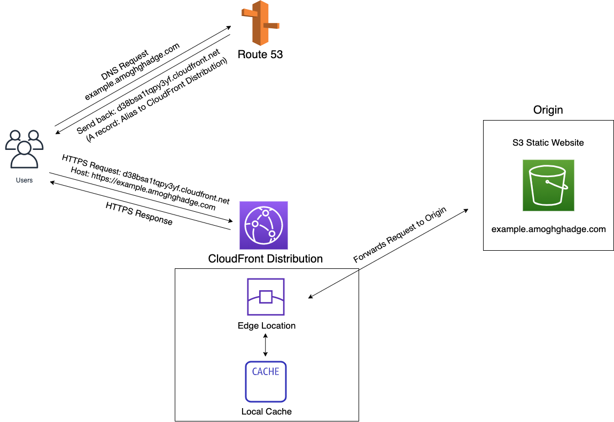

### Introduction
    These are multiple serverless websites, either as Examples or for Local Businesses, hosted 
    through Amazon Web Services. Each folder in this Repository is the code for a Website.
    
    Websites for Local Businesses:

    andersonmusicstudioandensemble.com
    drmadhubhatia.com
    opportunityedu.com (Hosted on Wordpress, code not included in this repo)

    Example Websites:
    
    amoghghadge.com
    restaurant.amoghghadge.com
    doctor.amoghghadge.com
___________________________________________________________________________________________________

### Hosting
These websites are hosted serverlessly on Amazon Web Services  

___________________________________________________________________________________________________

### Technical Components
   
- Website               : Uploaded to an S3 bucket 
- Endpoint               : CloudFront provides an HTTPS endpoint to the S3 bucket 
- DNS                    : Route 53 points the website domain name to the CloudFront Distribution 

___________________________________________________________________________________________________

### Architecture

